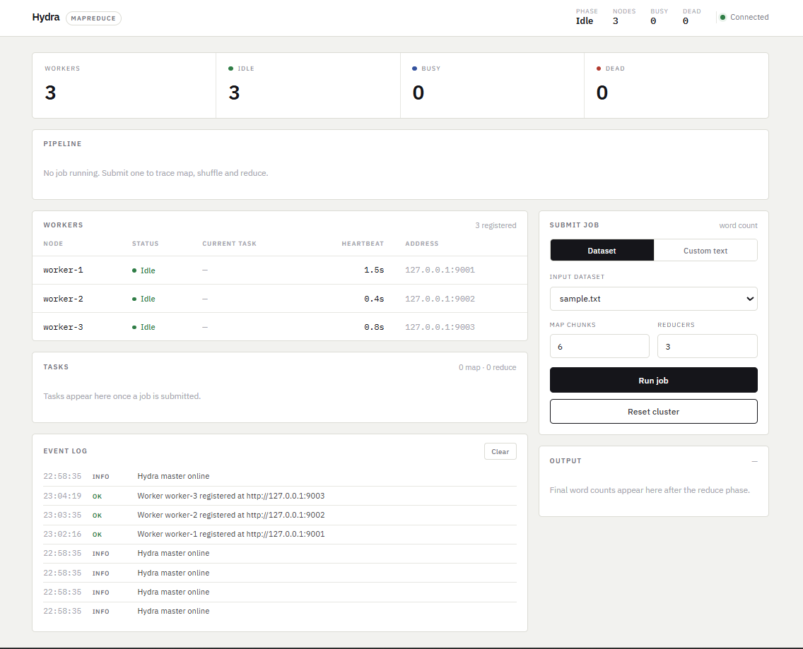
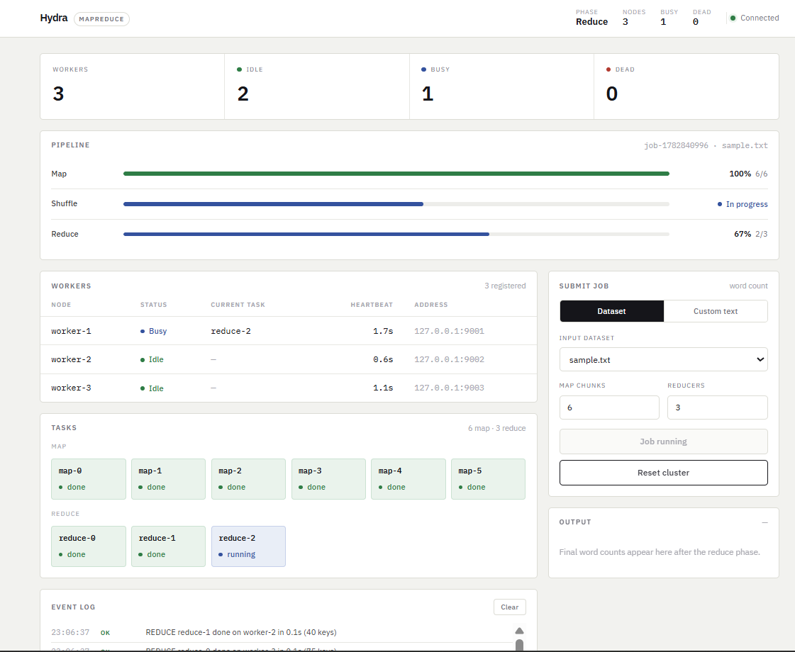
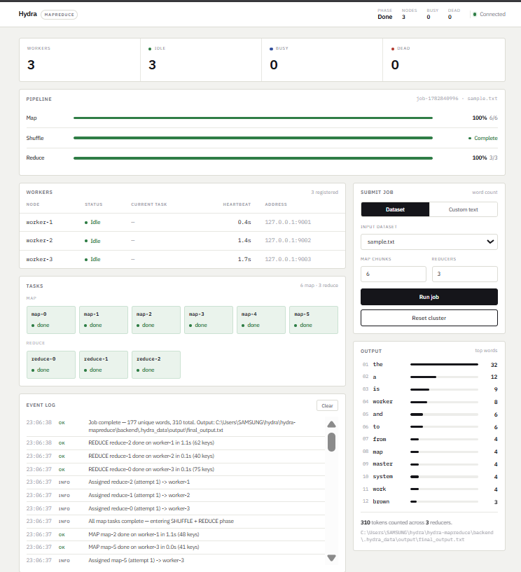
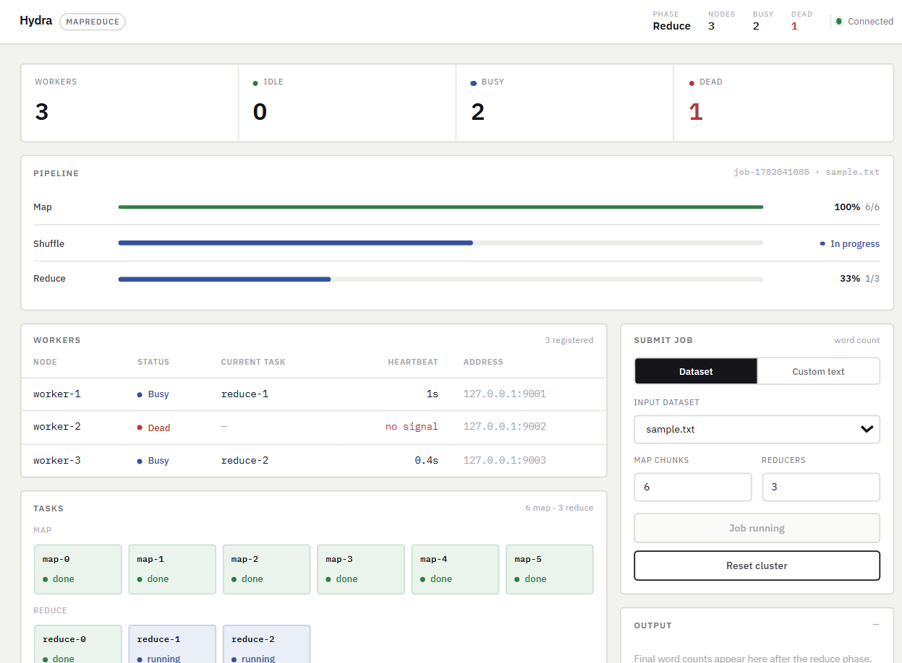

# Hydra — Mini Distributed MapReduce

A compact, **end-to-end distributed word-count engine** built on a classic
**Master–Worker** architecture, with real multi-process workers, heartbeat-based
failure detection, automatic task reassignment, a file-based shuffle, and a
polished real-time React dashboard.

It is deliberately small — one job type, ~700 lines of backend — but it
demonstrates the core ideas of a real MapReduce system: **distributed
scheduling, fault tolerance, partitioning/shuffle, and parallel processing**,
all visible live in the UI.

> Kill a worker mid-job and watch the master detect the dead heartbeat,
> recompute the lost intermediate data, and finish the job with **identical
> output** — no manual intervention.

---

## Dashboard

| Cluster idle | Job running (map phase) |
|---|---|
|  |  |

| Job complete | Worker failure → automatic recovery |
|---|---|
|  |  |

---

## Features

**Master**
- Accepts a job, splits the input into logical chunks (one map task each)
- In-memory worker registry driven by heartbeats
- Push-based scheduler assigns map → then reduce tasks to idle workers
- Heartbeat **timeout** ⇒ worker declared `DEAD`
- Task **timeout** ⇒ stuck task re-queued
- Automatic reassignment of in-flight work on failure
- Recomputes map output that was lost with a dead node (its files lived on
  that node's local disk and can no longer be served for the shuffle)
- Stale/duplicate results rejected via `(task_id, attempt)` so a slow,
  already-reassigned worker can never corrupt the output
- Triggers the reduce phase only after **all** map tasks succeed

**Worker** (real, separate OS process)
- Registers with the master and sends periodic heartbeats
- Runs the word-count **map + combiner** on its chunk
- Writes one **partition file per reducer**, keyed by `crc32(word) % R`
- Serves its partition files to reducers over HTTP (the file-based shuffle)
- Runs **reduce** tasks: fetches its partition from every map worker,
  merges + sorts, writes the final output file

**Dashboard (React)** — a monospace "operations console": warm paper theme,
inverted status bar, hairline rules, bracketed state codes (no chartjunk).
- Live cluster overview (workers / idle / busy / dead, current phase)
- Map → Shuffle → Reduce pipeline with progress bars
- Worker registry table with status codes + last-heartbeat freshness
- Task state-machine grid (PENDING / RUNNING / RETRYING / SUCCESS / FAILED, with attempt count)
- Streaming event log (assignments, failures, reassignments)
- Top-words ranking from the final output
- Job submission form (bundled dataset or custom text, configurable map/reduce count)

---

## Architecture

```
                ┌──────────────────────────────────────────────┐
                │                  MASTER  (:8000)              │
                │                                                │
   React UI ───►│  REST API   Scheduler loop   Health monitor   │
  (poll 1s)     │  registry · task table · phase state machine   │
                └───▲───────────────┬───────────────▲───────────┘
       register/    │   assign      │ assign        │  heartbeat /
       heartbeat    │   (push)      │ (push)        │  task_complete
                    │               ▼               │
          ┌─────────┴───┐   ┌───────────┐   ┌───────┴─────┐
          │  worker-1    │   │ worker-2  │   │  worker-3   │
          │  (:9001)     │   │ (:9002)   │   │  (:9003)    │
          │ map / reduce │   │map/reduce │   │ map/reduce  │
          └──────┬───────┘   └─────┬─────┘   └──────┬──────┘
                 │  shuffle: reducers GET /partition/<map>/<r>  │
                 └───────────────  (HTTP) ─────────────────────┘
                 local disk: .hydra_data/<worker>/intermediate/...
```

- **Transport:** plain HTTP/JSON via FastAPI. The same API the workers use also
  feeds the dashboard, so there is exactly one protocol to understand.
- **Scheduling:** the master *pushes* assignments to idle workers. All cluster
  state lives behind a single lock; outbound HTTP to workers happens **outside**
  the lock so a slow/dead worker can never freeze the scheduler.

### Data flow (one job)
1. Client submits a job → master splits the input into `num_map` chunks.
2. Master assigns map tasks to idle workers.
3. Each worker counts words in its chunk, partitions them by `crc32(word) % R`,
   and writes `part-0…part-(R-1)` to its local disk.
4. Master waits until **every** map task is `SUCCESS`.
5. Reduce phase: each reducer **fetches its partition from every map worker**
   (the shuffle), merges + sorts, and writes `output/part-<r>.txt`.
6. Master merges the reduce outputs into `output/final_output.txt` and surfaces
   the top words to the UI.

### State machines
```
Task:    PENDING ─► RUNNING ─► SUCCESS
            ▲          │
            │          ├─► (worker dies / timeout / error)
            └── RETRYING ◄┘            ─► FAILED (after MAX_ATTEMPTS)

Worker:  IDLE ⇄ BUSY ─► DEAD ─► (heartbeat returns) ─► IDLE

Job:     IDLE ─► MAP ─► REDUCE ─► DONE
                  ▲────────┘  (regression if a map holder dies)
```

---

## Fault tolerance — how recovery works

| Mechanism | Trigger | Master response |
|---|---|---|
| **Heartbeat timeout** | no heartbeat for `HEARTBEAT_TIMEOUT` (6s) | mark worker `DEAD` |
| **Re-queue in-flight** | dead worker had a `RUNNING` task | task → `RETRYING`, attempt++ |
| **Recompute lost output** | dead worker held a `SUCCESS` **map** task | re-run that map elsewhere (its partition files are unreachable) |
| **Phase regression** | a needed map holder died after reduce started | go back to `MAP`, reset reduce tasks |
| **Task timeout** | a `RUNNING` task exceeds `TASK_TIMEOUT` | re-queue it |
| **Stale-result guard** | a result arrives with the wrong `attempt` | **ignored** (logged) — keeps output correct |
| **Retry cap** | a task fails `MAX_ATTEMPTS` times | mark `FAILED` |

The `(task_id, attempt)` pair is the key correctness device: when a task is
reassigned its attempt number increments, so a late result from the *old*
attempt is recognised as stale and dropped instead of overwriting good data.

---

## Protocol (REST)

**Worker → Master**
| Method | Path | Body |
|---|---|---|
| POST | `/api/register` | `{worker_id, url}` |
| POST | `/api/heartbeat` | `{worker_id, status, current_task}` |
| POST | `/api/task_complete` | `{worker_id, task_id, attempt, ok, keys?, error?}` |

**Master → Worker**
| Method | Path | Body |
|---|---|---|
| POST | `/assign` | `{kind, task_id, attempt, num_reduce, …}` |
| GET | `/partition/{map_task_id}/{reduce_id}` | → `word\tcount` lines |

**Client/UI → Master**
| Method | Path | Body |
|---|---|---|
| POST | `/api/job` | `{dataset? \| text?, num_map, num_reduce}` |
| POST | `/api/reset` | — |
| GET | `/api/status` | full cluster + job snapshot |
| GET | `/api/logs?after=<seq>` | incremental event log |
| GET | `/api/datasets` | bundled sample files |

All messages are defined in [`backend/hydra/protocol.py`](backend/hydra/protocol.py).

---

## Project structure

```
hydra-mapreduce/
├── backend/
│   ├── hydra/
│   │   ├── config.py       # all timing/storage knobs (env-overridable)
│   │   ├── protocol.py     # enums + request/response models (the wire contract)
│   │   ├── mapreduce.py    # pure word-count map/reduce + crc32 partitioner
│   │   ├── logbus.py       # thread-safe in-memory event log for the UI
│   │   ├── master.py       # scheduler, heartbeats, failure detection, REST API
│   │   └── worker.py       # map/reduce execution + partition serving
│   ├── run_master.py
│   ├── run_worker.py
│   └── requirements.txt
├── frontend/               # Vite + React dashboard
│   └── src/{App.jsx, api.js, components/*}
├── data/                   # sample datasets
└── docs/screenshots/
```

---

## How to run

### 1. Backend — master + workers
```bash
cd backend
python -m venv .venv
.venv\Scripts\activate          # Windows  (source .venv/bin/activate on macOS/Linux)
pip install -r requirements.txt
```

Open **4 terminals** (all in `backend/`, venv activated):

```bash
# terminal 1 — master
python run_master.py

# terminals 2–4 — workers
python run_worker.py --id worker-1 --port 9001
python run_worker.py --id worker-2 --port 9002
python run_worker.py --id worker-3 --port 9003
```

> Tip: set `HYDRA_TASK_DELAY=1` before starting each process to give every task
> ~1s of work. This makes the progress bars animate and makes it easy to kill a
> worker *mid-task* for the failure demo.
> - PowerShell: `$env:HYDRA_TASK_DELAY=1; python run_worker.py --id worker-1 --port 9001`
> - bash: `HYDRA_TASK_DELAY=1 python run_worker.py --id worker-1 --port 9001`

### 2. Frontend — dashboard
```bash
cd frontend
npm install
npm run dev          # http://localhost:5173
```

Submit a job from the UI (or `curl`):
```bash
curl -X POST http://127.0.0.1:8000/api/job ^
  -H "Content-Type: application/json" ^
  -d "{\"dataset\":\"sample.txt\",\"num_map\":6,\"num_reduce\":3}"
```

The final result is written to `backend/.hydra_data/output/final_output.txt`.

---

## Demo: kill a worker, watch it recover

1. Start the master + 3 workers with `HYDRA_TASK_DELAY=1` and open the dashboard.
2. Submit a job with **more map tasks than workers** (e.g. 24 maps, 3 reducers).
3. While the map phase is running, **kill `worker-2`** (Ctrl+C in its terminal,
   or `taskkill /F /PID <pid>`).
4. Watch the dashboard:
   - within ~6s `worker-2` turns **DEAD** ("no signal"),
   - the event log shows *"declared DEAD"*, *"map output lost — recomputing"*,
     *"Re-queued …"*,
   - its tasks turn **RETRYING** and are reassigned to the survivors,
   - the job still reaches **DONE** with the same output.

Verified run (the output is byte-for-byte identical to a no-failure run):
```
177 unique words · 310 total tokens   ← with a worker killed mid-job
177 unique words · 310 total tokens   ← clean run
```

---

## Configuration (env vars)

| Var | Default | Meaning |
|---|---|---|
| `HYDRA_MASTER_HOST` / `HYDRA_MASTER_PORT` | `127.0.0.1` / `8000` | master bind address |
| `HYDRA_HEARTBEAT_INTERVAL` | `2.0` | worker heartbeat period (s) |
| `HYDRA_HEARTBEAT_TIMEOUT` | `6.0` | mark worker DEAD after this silence (s) |
| `HYDRA_TASK_TIMEOUT` | `45.0` | re-queue a task running longer than this (s) |
| `HYDRA_TASK_DELAY` | `0.0` | artificial per-task work time (s) — for demos |
| `HYDRA_MAX_ATTEMPTS` | `5` | retries before a task is `FAILED` |
| `HYDRA_DATA_ROOT` | `backend/.hydra_data` | intermediate + output storage |

The dashboard talks to `http://127.0.0.1:8000` by default; override with
`VITE_API` when running `npm run dev`.

---

## Design decisions (and the boundaries I drew)

- **HTTP/JSON over gRPC or raw sockets.** One readable protocol that doubles as
  the UI backend; no codegen, no custom framing. Easy to explain in 60 seconds.
- **Push scheduling with a single lock.** Simple to reason about; network I/O is
  kept off the lock so one bad worker can't stall the cluster.
- **File-based shuffle.** Reducers pull partitions over HTTP from each map
  worker — exactly why losing a map worker means recomputing its map output.
- **Combiner in the map step.** Pre-summing within a chunk shrinks intermediate
  data — a real MapReduce optimisation, one line of code here.
- **In-memory state.** State is intentionally not persisted; the focus is the
  coordination/recovery logic, not durability.

**If I were to extend it:** persist job metadata (SQLite) to survive a master
restart, speculative execution for stragglers, streaming partition transfer for
large data, and multiple master replicas behind a leader election.

---

## Tested

- Correctness: distributed output **exactly matches** a single-process word
  count of the same input.
- Fault tolerance: a worker killed mid-job is detected, its work (including
  completed-but-now-unreachable map output) is recomputed/reassigned, and the
  job completes with identical results.
